# Backstage Codebase — AI Readability & Development Issues

> **Phân tích ngày**: 2026-05-28  
> **Phạm vi**: `packages/` (69 packages) + `plugins/` (156 plugins)  
> **Scale**: 4,847 TS/TSX source files | ~451,264 LOC (non-test)

## Executive Summary

Backstage codebase có **15 vấn đề** ảnh hưởng đến khả năng AI đọc hiểu và phát triển code. Các vấn đề được phân nhóm theo mức độ nghiêm trọng.

---

## Issues by Severity

### 🔴 Critical (AI cannot reliably work)

| # | Issue | Core Problem |
|---|-------|-------------|
| [001](./001-opaque-type-system.md) | **Opaque Type System** | Public types chỉ chứa `$$type` marker — AI không resolve được actual data structures |
| [002](./002-extreme-generics-complexity.md) | **Extreme Generics Complexity** | Functions có 8+ generic params, recursive conditional types, union-to-intersection tricks |

### 🟠 High (AI produces incorrect/incomplete results)

| # | Issue | Core Problem |
|---|-------|-------------|
| [003](./003-internal-alias-imports.md) | **Private Internal Packages** | `@internal/*` aliases break standard import resolution |
| [004](./004-massive-reexport-chains.md) | **Massive Re-export Chains** | 4-5 level barrel file chains overflow AI context window |
| [005](./005-dual-frontend-system.md) | **Dual Frontend System** | Old `core-*` + New `frontend-*` systems coexist with compat layer |
| [006](./006-dynamic-dependency-injection.md) | **Dynamic DI via ServiceRef** | Runtime DI invisible to static analysis — AI can't trace dependencies |
| [011](./011-cross-package-relative-imports.md) | **Cross-Package Relative Imports** | 31 files use `../../../` imports bypassing published APIs |
| [012](./012-runtime-plugin-discovery.md) | **Runtime Plugin Discovery** | `require()` + filesystem scanning — plugin graph only exists at runtime |

### 🟡 Medium (AI needs workarounds)

| # | Issue | Core Problem |
|---|-------|-------------|
| [007](./007-documentation-gaps.md) | **Documentation Gaps** | `@ignore` hides critical types, `TODO` placeholders on core concepts |
| [008](./008-naming-collisions.md) | **Naming Collisions** | Same terms mean different things in backend vs frontend |
| [009](./009-config-schema-indirection.md) | **Config Schema Indirection** | YAML + TypeScript schemas + runtime access = multi-file tracing |
| [010](./010-version-bridge-complexity.md) | **Version Bridge** | Concurrent versions add runtime branching invisible to AI |
| [013](./013-complex-init-ordering.md) | **Complex Initialization Ordering** | Topological sort with reversed deps, parallel init, lifecycle hooks |
| [014](./014-callback-deferred-execution.md) | **Callback-Heavy Deferred Execution** | Registration callbacks look sequential but execute at completely different times |
| [015](./015-hacky-workarounds.md) | **Hacky Workarounds** | `as any` duck typing, manual type sync, IIFE classes, TODO-marked temp code |

---

## Key Statistics

```
Codebase Scale:
  Total packages:                 69
  Total plugins:                  156
  Total TS/TSX source files:      4,847
  Total LOC (non-test):           ~451,264
  yarn.lock size:                 1.83 MB

Type System Complexity:
  Opaque $$type markers:          50+ unique instances
  Generic parameters per fn:      Up to 8+
  @ignore types (wiring only):    13+
  `as any` casts (wiring only):   20+

Module Boundary Issues:
  @internal/* alias packages:     4 packages
  Cross-package relative imports: 31 files
  Barrel files with `export *`:   27+
  Re-export chain depth:          Up to 4-5 levels

API Surface Complexity:
  @deprecated annotations:        118+
  Parallel API systems:           2 (core-* vs frontend-*)
  Config schema systems:          2 (Zod deprecated + StandardSchemaV1)
  Registration type versions:     2 (V1 + V1.1)
  Dynamic require() calls:        15+ in backend-defaults alone
```

---

## Issue Categories

### By Theme

```mermaid
graph TD
    A[AI Issues] --> B[Type Comprehension]
    A --> C[Code Navigation]
    A --> D[Architectural Ambiguity]
    A --> E[Runtime vs Static Gap]
    A --> F[Code Quality]

    B --> B1["#001 Opaque Types"]
    B --> B2["#002 Extreme Generics"]
    B --> B7["#007 Doc Gaps"]

    C --> C3["#003 Internal Aliases"]
    C --> C4["#004 Re-export Chains"]
    C --> C11["#011 Relative Imports"]

    D --> D5["#005 Dual Frontend"]
    D --> D8["#008 Naming Collisions"]
    D --> D9["#009 Config Indirection"]

    E --> E6["#006 Dynamic DI"]
    E --> E10["#010 Version Bridge"]
    E --> E12["#012 Runtime Discovery"]
    E --> E13["#013 Init Ordering"]
    E --> E14["#014 Callback Deferred"]

    F --> F15["#015 Hacky Workarounds"]
```



### By Affected System

| System | Issues |
|--------|--------|
| **Backend Plugin API** | #001, #002, #006, #008, #011, #013, #014 |
| **Frontend Plugin API** | #001, #002, #003, #005, #008, #013, #014 |
| **Backend App API** | #011, #012, #013, #015 |
| **Frontend App API** | #004, #005, #011, #013 |
| **Shared Infrastructure** | #003, #007, #009, #010, #015 |

---

## Root Causes

1. **Intentional API opacity**: Backstage deliberately hides internal types for API stability → breaks AI comprehension
2. **Migration in progress**: Old → New frontend system creates duplication and ambiguity
3. **Framework-for-frameworks**: Abstractions are inherently deep — each layer adds indirection
4. **Monorepo scale**: 224 packages with cross-references exceed typical AI context limits
5. **Runtime-first architecture**: Plugin discovery, DI, and initialization are all runtime-resolved

## Recommendations for AI-Assisted Development

1. **Always specify package context** (backend vs frontend, old vs new system)
2. **Use `@backstage/frontend-plugin-api`** (new system) unless working on legacy code
3. **Treat `BackendFeature`/`ExtensionDefinition` as opaque** — don't access internal properties
4. **Check `package.json` `backstage.role`** to determine package type
5. **Build local knowledge base** mapping ServiceRef IDs → actual service interfaces
6. **Read `BackendInitializer.ts`** first to understand backend lifecycle
7. **Read `resolveAppTree.ts`** first to understand frontend extension tree
8. **Trace `@internal/*` imports** via workspace `package.json` name field
9. **Don't mix `core-*` and `frontend-*` imports** in the same file
10. **Watch for `@deprecated`** — 118+ deprecation warnings across packages
